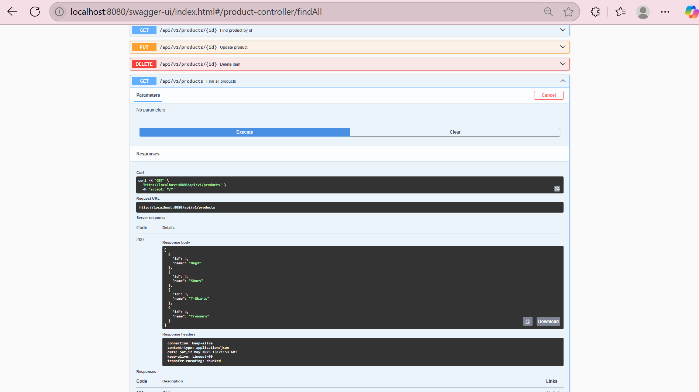
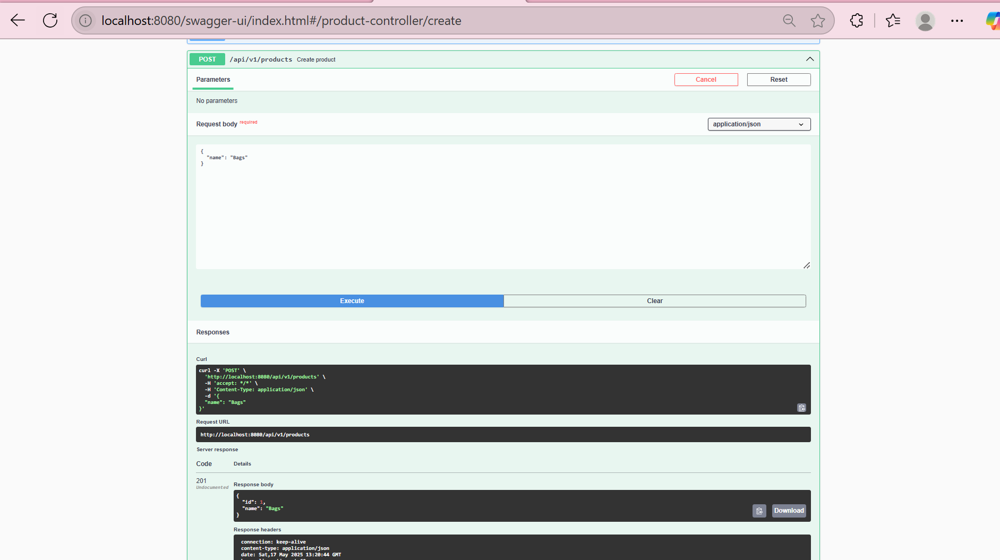
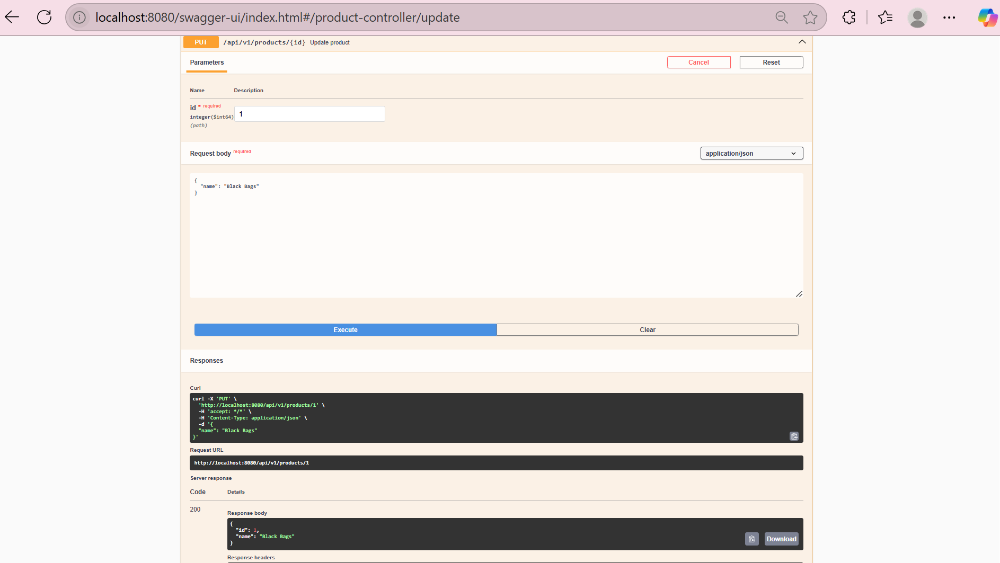
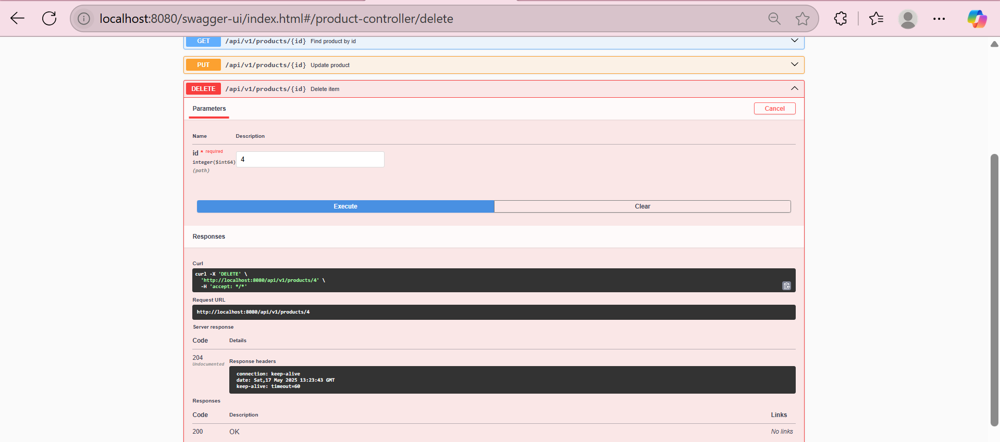
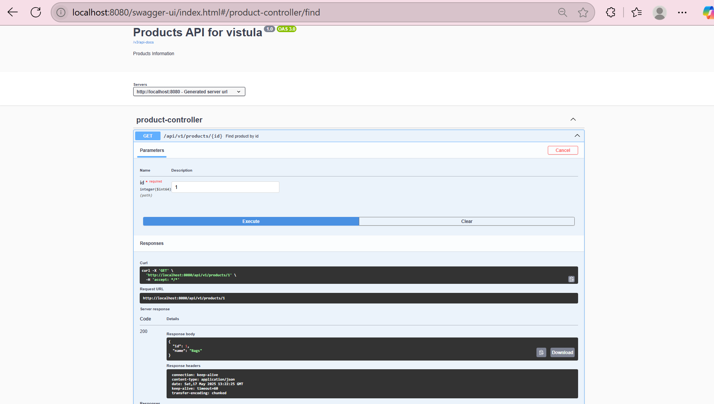
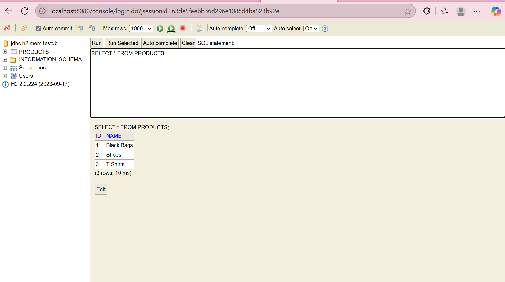

# 🔧 Spring Boot Task 2 – Building a RESTful API with Layers and Exception Handling

I built a full REST API using the **Layered Architecture pattern** (Controller → Service → Repository), simulated a database with `HashMap`, handled exceptions, and added Swagger UI for documentation and testing.

## 🎯 Objective

- Create a backend-only Spring Boot application (no frontend this time)
- Structure the project using clean architectural layers
- Use stereotypes: `@Controller`, `@RestController`, `@Service`, `@Repository`, `@Component`
- Simulate data persistence using a `HashMap` (later replaced with a real DB)
- Handle HTTP requests: GET, POST, PUT, DELETE
- Add proper exception handling
- Visualize and test API with **Swagger UI**
- Later connect to a real H2 in-memory database

## ⚙️ Project Setup

- **Created using:** IntelliJ’s built-in Spring Initializr
- **Dependencies:**
  - Spring Web
  - Spring Boot DevTools
  - H2 Database (for future use)
  - Spring Data JPA
  - Lombok
  - OpenAPI (Swagger)

---

## ✅ What I Did

1. **Built a Complete REST API**
   - Created endpoints to `create`, `read`, `update`, `delete`, and `list` products.
   - Used path variables (`@PathVariable`) and request bodies (`@RequestBody`).

2. **Implemented Clean Separation of Concerns**
   - Created a `ProductService` for logic.
   - Used a `ProductMapper` to convert between entities and DTOs.

3. **Simulated a Database**
   - Used a `HashMap<Long, Product>` to store data before integrating H2.

4. **Handled Exceptions Properly**
   - Created `ProductNotFoundException` and global handler with `@ControllerAdvice`.
   - Returned clean error responses instead of 500s.

5. **Documented and Tested with Swagger**
   - Added `springdoc-openapi-ui` to `pom.xml`.
   - Accessed interactive UI at `/swagger-ui/index.html`.

6. **Connected to a Real Database**
   - Switched to **H2 in-memory DB** with JPA and annotations like `@Entity`, `@Id`.

7. **Added PUT and DELETE functionality**
   - Enabled full CRUD operations using HTTP methods
   - Tested with Postman, Swagger, and browser
     
## 🧠 What I Learned

- How to build a real REST API using Spring Boot
- Why layering (controller/service/repo) matters for maintainability
- The power of annotations like `@RestController`, `@Service`, `@Component`
- How to use `Optional`, `orElseThrow()`, and `Supplier` for clean null handling
- How to handle exceptions with `@ControllerAdvice` and return user-friendly messages
- Swagger UI integration for API testing and docs
- Transitioning from in-memory mocks to actual databases (H2)

## 📬 API Endpoints

| Method | Endpoint                      | Description                          |
|--------|-------------------------------|--------------------------------------|
| GET    | `/api/v1/products/{id}`       | Get product by ID                    |
| GET    | `/api/v1/products`            | Get all products                     |
| POST   | `/api/v1/products`            | Create a new product                 |
| PUT    | `/api/v1/products/{id}`       | Update an existing product           |
| DELETE | `/api/v1/products/{id}`       | Delete a product by ID               |

## 🖼️ Screenshots

**Author:** Winifred Imade Ogbeiwi  
**School:** Vistula University  
**Track:** Computer Engineering  
